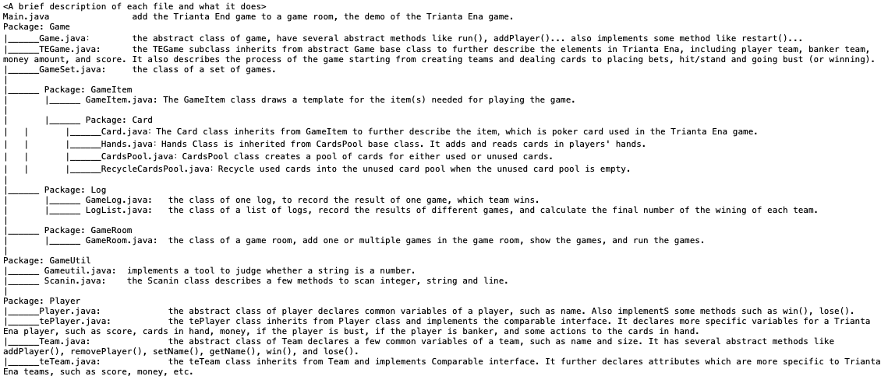

# Blackjack (Greek version: Trianta Ena) <a target="_blank" title="Picked off of Google Images"></a>


## Description
What is Trianta Ena?
Trianta Ena (Τριανταένα) is a card game originating from Greece, 
and its name means "31" in Greek. It's similar to 
blackjack but slightly different. The goal is to have a 
hand of cards that add up as close as possible to 31 without 
going over, with face cards counting as 10, aces counting as 11, 
and other cards holding their face value. The game is popular in 
Greece, particularly played around holidays like Christmas and 
New Year's Eve. Players typically use a standard deck of cards, 
and there is often a betting component, where each player 
contributes to a pot, which the winner takes. Here, this game 
assigns one player as banker and the rest of the players as normal ones. 

## Package overview


## How to compile and run?
1. Git clone the repo.
2. Navigate to downloaded folder directory.
   ```shell
    cd YourWorkSpaceDir/TriantaEna
    ```
3. Compile
    ```shell
   javac -d bin *.java
   ```
4. Run the Main program
    ```shell
   java -cp bin Main
   ```

## How to interact with the terminal to play Trianta Ena? 
### Program successfully runs and outputs:
	Welcome to the TriantaEna!
	Please input the number of players:
### Input:
	3
### Output:
	Please input Player 0's name:
### Input:
	Zoe
### Output:
	Please input Player 1's name:
### Input:
	Jack
### Output:
	Please input Player 2's name:
### Input:
	Amy
### Output:
	The TriantaEna Game need a first banker.
	Hello,Zoe!Do you want to be the Banker?(Y/N)
### Input:
	n
### Output:
	Hello,Jack!Do you want to be the Banker?(Y/N)
### Input:
	n
### Output:
	Hello,Amy!Do you want to be the Banker?(Y/N)
### Input:
	n
### Output:
	Since no one want to be the Banker, Game will randomly choose one lucky guy to be the banker:
	The First Banker is:Amy
	Round 1 start!
	First Card dealt to Banker:Amy
	Since this is Banker's first Card, it's known to all of players, the card is:♣6
	-----------------------------------------
	Hello,Zoe!
	This is your Card♥K
	-----------------------------------------
	Hello,Jack!
	This is your Card♣10
	-----------------------------------------
	Hello everyone! Now It's time to choose whether to place a bet
	Hello,Zoe!
	This is overall information:
	★Amy(banker rest money:30000):♣6
	Jack(rest money:10000, current bet:0):*
	Zoe(rest money:10000, current bet:0):♥K
	-----------------------------------------
	Do you want to place a bet? (Y/N) (Y means you choose to take a bet and N means you choose to fold)
### Input:
    y
### Output:
    Great!How much do you want to bet?(Your rest money is:+10000)
### Input:
    100
### Output:
    Your bet is:100,and your rest money is:9900
    -----------------------------------------
    Hello,Jack!
    This is overall information:
    ★Amy(banker rest money:30000):♣6
    Zoe(rest money:9900, current bet:100):*
    Jack(rest money:10000, current bet:0):♣10
    -----------------------------------------
    Do you want to place a bet? (Y/N) (Y means you choose to take a bet and N means you choose to fold)
### Input:
    y
### Output:
    Great!How much do you want to bet?(Your rest money is:+10000)
### Input:
    200
### Output:
    Your bet is:200,and your rest money is:9800
    -----------------------------------------
    Hello everyone! Here are your rest 2 cards!
    Hello,Zoe!
    These are your Cards♥6,♦2
    -----------------------------------------
    Hello,Jack!
    These are your Cards♦6,♦8
    -----------------------------------------
    Hello,Zoe!This is overall information:
    ★Amy(banker rest money:30000):♣6
    Jack(rest money:9800, current bet:200):* ♦6 ♦8
    Zoe(rest money:9900, current bet:100):♥K ♥6 ♦2
    -----------------------------------------
    Do you want to hit?(Y/N)
### Input:
    y
### Output:
    This is your Card♣3
    Now the cards in your hand are:
    ♥K ♥6 ♦2 ♣3
    Do you want to hit once more?
### Input:
    y
### Output:
    This is your Card♠K
    Now the cards in your hand are:
    ♥K ♥6 ♦2 ♣3 ♠K
    Do you want to hit once more?
### Input:
    n
### Output:
    Hello,Jack!This is overall information:
    ★Amy(banker rest money:30000):♣6
    Zoe(rest money:9900, current bet:100):* ♥6 ♦2 * *
    Jack(rest money:9800, current bet:200):♣10 ♦6 ♦8
    -----------------------------------------
    Do you want to hit?(Y/N)
### Input:
    y
### Output:
    This is your Card♣8
    AND BOOM! YOU ARE BUST WITH HANDS:
    ♣10 ♦6 ♦8 ♣8
    It's time to reveal your cards to BANKER!
    Zoe(rest money:9900, current bet:100):
    ♥K ♥6 ♦2 ♣3 ♠K
    Jack(rest money:9800, current bet:200):
    ♣10 ♦6 ♦8 ♣8
    Banker hit time!
    Hello,Amy!Do you want to hit? (Y/N)
### Input:
    y
### Output:
    This is your Card♥5
    Now the cards in your hand are:
    ♣6 ♥5
### Input:
    Do you want to hit once more?(Y/N)
### Input:
    y
### Output:
    This is your Card♣2
    Now the cards in your hand are:
    ♣6 ♥5 ♣2
    Do you want to hit once more?(Y/N)
### Input:
    y
### Output:
    This is your Card♥8
    Now the cards in your hand are:
    ♣6 ♥5 ♣2 ♥8
    Do you want to hit once more?(Y/N)
### Input:
    y
### Output:
    This is your Card♥A
    Now the cards in your hand are:
    ♣6 ♥5 ♣2 ♥8 ♥A
    Do you want to hit once more?(Y/N)
### Input:
    y
### Output:
    This is your Card♣5
    And your hands value is equals or exceeds 27 with hands:
    ♣6 ♥5 ♣2 ♥8 ♥A ♣5
    So you are not allowed to hit
    ★Amy(banker rest money:30000)♣6 ♥5 ♣2 ♥8 ♥A ♣5
    Banker's hands value is:27
    Zoe(rest money:9900, current bet:100)♥K ♥6 ♦2 ♣3 ♠K
    Zoe's hands value is:31
    Congratulation,Zoe! You win! and you can get an extra 100 from the Banker!
    Jack(rest money:9800, current bet:200)♣10 ♦6 ♦8 ♣8
    Jack is bust
    Although not a winner,but you can take your bet back!
    Zoe's money:10100
    Jack's money:10000
    Hello,Zoe!Do you want to play another round? Y/N
### Input:
    y
### Output:
    Hello,Jack!Do you want to play another round? Y/N
### Input:
    y
### Output:
    Round 2 start!
    First Card dealt to Banker:Amy
    Since this is Banker's first Card, it's known to all of players, the card is:♣A
    -----------------------------------------
    Hello,Zoe!
    This is your Card♦8
    -----------------------------------------
    Hello,Jack!
    This is your Card♣Q
    -----------------------------------------
    Hello everyone! Now It's time to choose whether to place a bet
    Hello,Zoe!
    This is overall information:
    ★Amy(banker rest money:29900):♣A
    Jack(rest money:10000, current bet:0):*
    Zoe(rest money:10100, current bet:0):♦8
    -----------------------------------------
    Do you want to place a bet? (Y/N) (Y means you choose to take a bet and N means you choose to fold)
### The game goes on and on if players want to continue playing. If not, the terminal will return messages like this:
    Thanks for playing!
    Jack choose to cash out
    Players number is less than 2,the game end!
    This is the score of every player:
    Zoe:20200
    Jack:10000
    Amy:19800

# That's it. Enjoy the game! <a target="_blank" title="Picked off of Google Images"></a>
